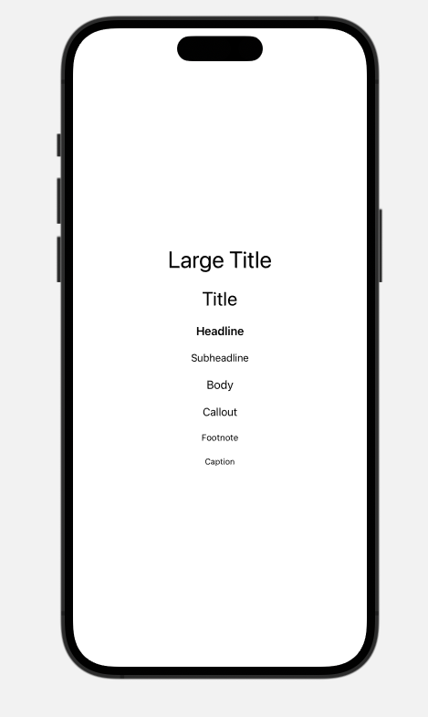
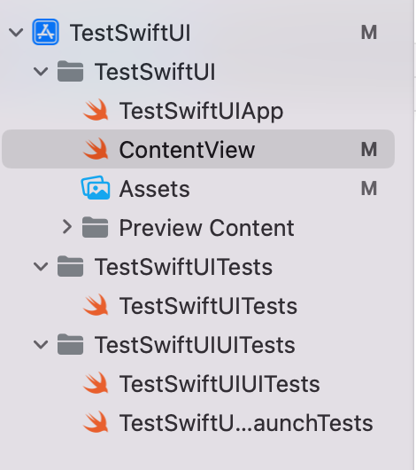
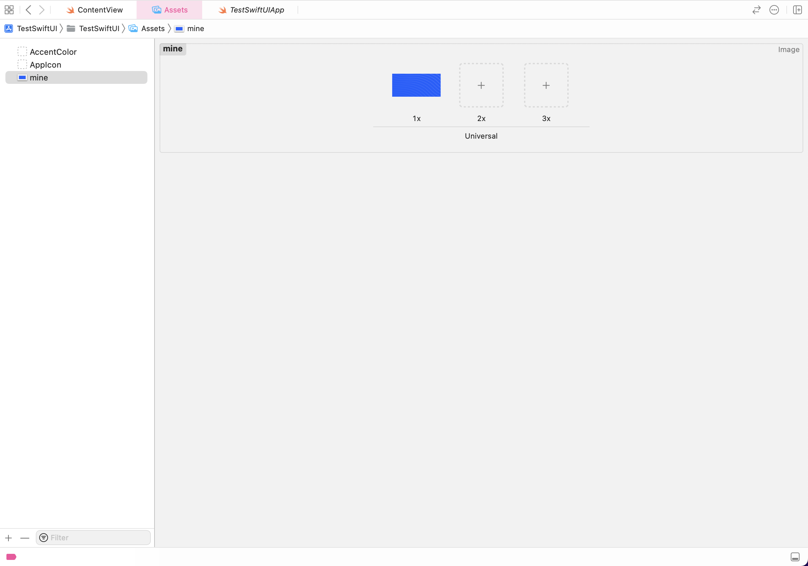

# Hiding the scrollbar for lists
On iOS 16+ use the code below:

```swift
.scrollIndicators(.hidden)
```
For example:

```swift
List {
    ForEach(items, id: \.self) { item in
        Text("Item \(item)")
            .listRowInsets(EdgeInsets())
    }
}
.listStyle(PlainListStyle())
.scrollIndicators(.hidden)
```

## Removing default styles of lists

Apply this to the list.
```swift
.listStyle(PlainListStyle())
```

## Removing default padding of list items

Apply this modifier to the list items.
```swift
.listRowInsets(EdgeInsets())
```
## Making a list 
Just use the code below.

```swift
List {
    ForEach(items, id: \.self) { item in
        Text("Item \(item)")
    }
}
```

## Getting device width and height
```swift
let deviceWidth = UIScreen.main.bounds.height
let deviceHeight = UIScreen.main.bounds.width
```

## Using hexadecimal color codes
Apply the extension below on the <code>Color</code>
class.
```swift
extension Color {
    init(hex: Int, opacity: Double = 1.0) {
        let red = Double((hex & 0xff0000) >> 16) / 255.0
        let green = Double((hex & 0xff00) >> 8) / 255.0
        let blue = Double((hex & 0xff) >> 0) / 255.0
        self.init(.sRGB, red: red, green: green, blue: blue, opacity: opacity)
    }
}
```

Then use it as below
For example:

```swift
Color(hex: 0xF5F8FA)
```

## How to ignore the safe area
Apply this modifier to your view

```swift
.edgesIgnoringSafeArea(.all)
```

## Have multiple device previews

As easy as below. Bear in mind that the preview device
name exactly matches the device name shows in Xcode.

```swift
struct ContentView_Previews: PreviewProvider {
    static var previews: some View {
        ContentView()
            .previewDisplayName("iPhone 14 Pro Max")
            .previewDevice("iPhone 14 Pro Max")
        
        ContentView()
            .previewDisplayName("iPhone 14 Plus")
            .previewDevice("iPhone 14 Plus")
        
        ContentView()
            .previewDisplayName("iPhone SE")
            .previewDevice("iPhone SE (3rd generation)")
    }
}
```

## Responsive font size

Avoid using static font sizes, instead, calculate it dynamically using the function below.

```swift
private func customFont(size: CGFloat) -> Font {
    let textStyle = UIFont.TextStyle.body
    let scaledSize = UIFontMetrics(forTextStyle: textStyle).scaledValue(for: size)
    return Font.system(size: scaledSize)
}
```
And then simply call this function on the static font size that you use.
For example:
Instead of applying the font size like below

```swift
.font(24)
```
Do it as below

```swift
.font(customFont(size: 24))
```

Dont forget to put the code below on top of your view in order to make it work

```swift
struct ContentView: View {
    @Environment(\.sizeCategory) var sizeCategory
.
.
.
.
```

## Making an image resizable

Simply apply the modifier below

```swift
.resizable()
```

## Making an image to scale to fit its parent view


Simply apply the modifier below

```swift
.scaledToFit()
```

## VStack and HStack alignment 

Despite Flutter that both the Row and Column widgets
could align their elements both horizontally and vertically, HStack can only align vertically 
and VStack can only align horizontally. How do we fix this flaw then?
By a view called <code>Spacer</code> which is exactly similar to the <code>Expanded</code>
widget in Flutter

To apply alignment to HStack
do as below.

```swift
HStack(alignment: .top) {
    YourView()
    Spacer()
}
```
To apply alignment to VStack
do as below.

```swift
VStack(alignment: .leading) {
    YourView()
    Spacer()
}
```

## Default fonts in Swift UI


Whichever of the font sizes above you want, you can 
access it by the <code>Font</code> class as below

```swift
Font.title
```

## Adding asset images 

Go to the <code>Assets</code> folder, as you see in the image below



And just drag and drop your image to this page or click the <code>+</code> and choose your image.




## Using Bundle images in framework

Using assets in framework is not easy and straightforward since the host application only utilizes its own assets not the ones on framework, to fix issue take a look at the code below and import images this way not normally. This resolves the collision.

```swift
let frameworkBundle = Bundle(for: <FrameworkClass>.self)
                    let image = UIImage(named: "bg", in: frameworkBundle, compatibleWith: nil)!
                    Image(uiImage: image)
                        .resizable()
                        .scaledToFit()
                        .cornerRadius(16)
```

Put the main class of your framework instead of ```<FrameworkClass>```